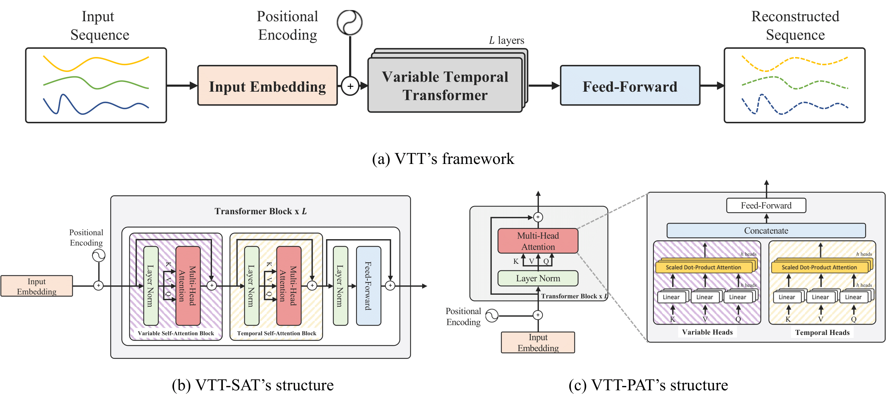
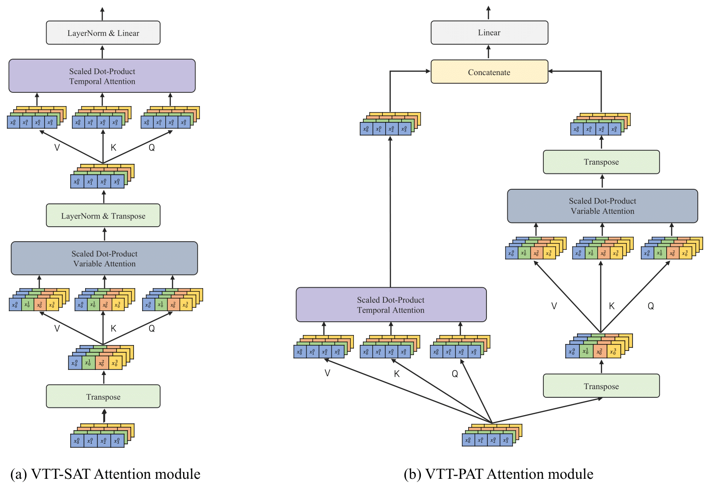

# Variable Temporal Transformer(VTT; KBS 2024 research paper)

**Transformer-based multivariate time series anomaly detection using inter-variable attention mechanism**
[[paper]](https://www.sciencedirect.com/science/article/pii/S0950705124001424?ref=pdf_download&fr=RR-2&rr=88e52cc379d63158)

The primary objective of multivariate time-series anomaly detection is to spot deviations from regular patterns in time-series data compiled concurrently from various sensors and systems. This method finds application across diverse industries, aiding in system maintenance tasks. Capturing temporal dependencies and correlations between variables simultaneously is challenging due to the interconnectedness and mutual influence among variables in multivariate time-series. In this paper, we propose a unique method, the Variable Temporal Transformer (VTT), which utilizes the self-attention mechanism of transformers to effectively understand the temporal dependencies and relationships among variables. This proposed model performs anomaly detection by employing temporal self-attention to model temporal dependencies and variable selfattention to model variable correlations. We use a recently introduced evaluation metric after identifying potential overestimations in the performance of traditional time series anomaly detection methods using the point adjustment protocol evaluation metric. We confirm that our proposed method demonstrates cutting-edge performance through this new metric. Furthermore, we bring forth an anomaly interpretation module to shed light on anomalous data, which we verify using both synthetic and real-world industrial data.

- We introduce variable attention that considers variable correlations using the transpose matrix of the existing attention input.

- We enable pinpointing anomaly occurrences and estimating causal variables by tracking changes in association weights during inference.
  
- The VTT achieves state-of-the-art results, with ablation studies and real-world data confirming the effectiveness and interpretability of our approach.

||
|:--:| 
| *Figure 1. Variable Temporal Transformer architecture.* |

||
|:--:| 
| *Figure 2. The attention module and structure of VTT-SAT and VTT-PAT.* |


## Citation
If you find this repo useful, please cite our paper.

```
@article{kang2024transformer,
  title={Transformer-based multivariate time series anomaly detection using inter-variable attention mechanism},
  author={Kang, Hyeongwon and Kang, Pilsung},
  journal={Knowledge-Based Systems},
  pages={111507},
  year={2024},
  publisher={Elsevier}
}
```

## Contact
If you have any question or want to use the code, please contact hyeongwon_kang@korea.ac.kr

---

```sh
.
├── LICENSE
├── README.md
├── image
├── notebook
└── src
    ├── data_provider    # data load, preprocessing, dataloader setting
    │   ├── dataloader.py
    │   └── dataset.py
    ├── layers    # layers for models (attention, embedding, etc.)
    │   ├── Attention.py
    │   ├── Embed.py
    │   └── Transformer_Enc.py
    ├── models
    │   ├── VTTPAT.py
    │   └── VTTSAT.py
    ├── utils    # utils
    │   ├── metrics.py   # metrics for inference
    │   ├── tools.py    # adjust learning rate, visualization, early stopping
    │   └── utils.py    # seed setting, load model, version build, progress bar, check points, log setting
    ├── scripts    # utils
    ├── config.yaml    # configure
    │   ├── run.sh
    │   └── test.sh
    ├── main.py    # main code
    └── model.py    # model build (build, train, validation,test, inference)
   

5 directories, 18 files

```
